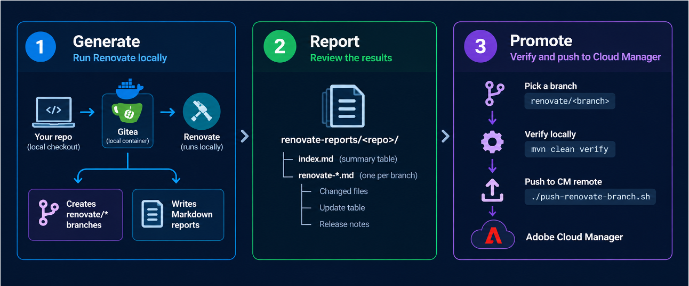

# aem-cm-renovate

Run [Renovate](https://docs.renovatebot.com/) **locally against Adobe Cloud Manager
(CM) repositories** and push the dependency-update branches it produces to the CM
remote, where the pipeline builds and deploys them.

### Why local?

Renovate is designed to run as a bot against a hosted git *platform*
(GitHub/GitLab/Bitbucket/Gitea) where it opens pull requests. **Adobe Cloud Manager
git is not one of those platforms** — there's no Renovate app/PR integration for it,
so you can't point hosted Renovate at a CM repo. This harness works around that: it
runs real Renovate locally against a throwaway [Gitea](https://about.gitea.com/)
mirror of your CM repo, so Renovate does its full job (Maven-property edits, npm
lockfile regen, grouping, changelogs) — then you selectively **verify and push**
the resulting branches to the real CM remote and let the CM pipeline take over.

### What it does



> The **Promote** stage in the diagram is the `validate-push.sh` script (formerly
> `push-renovate-branch.sh`).

1. **Generate** — run Renovate locally → real `renovate/*` branches in your checkout,
   with **nothing pushed to CM** during this step.
2. **Report** — a Markdown report per branch (update table + release-notes / change
   history).
3. **Promote** — pick a branch, `mvn clean verify` it locally, then push it to the CM
   remote or merge it into your local base branch.

Everything in steps 1–2 stays on `localhost`; the Gitea container is **torn down
automatically** when the generate run finishes. Only step 3 (`validate-push.sh`)
touches the real CM remote, and only after you confirm. That step can optionally run
the **same Adobe Cloud Manager pipeline validation** as the GitHub Actions workflow
(see `--cloud-manager` below).

---

## Requirements

| Tool | Why | Notes |
|------|-----|-------|
| **Node.js ≥ 20** + npm | runs Renovate (pinned in `package.json`) | tested on Node 24 / npm 11 |
| **Docker** (Desktop) | runs the throwaway local Gitea server | generate step only; started/stopped by the script |
| **git** | fetches branches / pushes to CM | 2.x; must be able to push to your CM remote |
| **Maven + JDK** | `mvn clean verify` in the promote step | match the JDK in the repo's `.cloudmanager/java-version` |
| **bash** | the scripts | macOS/Linux |
| **Adobe I/O (`aio`) CLI** | `--cloud-manager` pipeline validation | installed automatically by `npm install` (see Setup); the Cloud Manager plugin is added by the `postinstall` hook |
| **`jq`** | builds the CM auth config for `--cloud-manager` | only needed when using `--cloud-manager` |
| *(optional)* `GITHUB_COM_TOKEN` | richer release notes / changelogs, avoids github.com rate limits | read-only public-scope PAT is enough |

Every script takes the target repo as an explicit **full path** argument. There is
no default and no assumed location — omitting the path is an error.

---

## Layout

```
aem-cm-renovate/
├── run-all.sh                     # ALL: generate → validate each → (optionally) push → summary
├── renovate-local.sh              # GENERATE: Gitea → branches → reports → teardown
├── validate-push.sh               # PROMOTE: pick a branch → mvn verify → push to CM / merge
│                                  #          (+ optional --cloud-manager pipeline run)
├── cleanup-renovate-branches.sh   # delete local renovate/* branches
├── lib/
│   ├── build-report.js            # generates the Markdown reports from Gitea PRs
│   └── json-get.js               # tiny JSON field reader used by the shell
├── default-renovate.json          # config injected when a repo has no renovate.json
├── package.json / package-lock.json  # pins renovate + the Adobe I/O (aio) CLI
├── node_modules/                  # installed renovate + aio CLI (after `npm install`)
├── .renovate-tmp/                 # scratch: gitea token, run log, base cache
└── renovate-reports/<repo>/       # generated Markdown reports (index.md + per-branch)
```

---

## Setup

```bash
cd aem-cm-renovate
npm install        # installs Renovate + the Adobe I/O (aio) CLI into node_modules/,
                   # and (via postinstall) the aio Cloud Manager plugin
```

> The `postinstall` hook runs `aio plugins:install @adobe/aio-cli-plugin-cloudmanager`
> so the Cloud Manager plugin is always available for `--cloud-manager`. It is tolerant
> of being offline (`|| true`); `validate-push.sh` also installs the plugin on first use
> if it is missing.

---

## Usage

### 0. All-in-one (generate → validate → optionally push)

`run-all.sh` drives the whole flow: it generates every branch, builds
each one with `mvn clean verify`, and — only with `--push` — pushes the branches
that pass to the CM remote. It writes a **promotion summary** at the end. It is
**dry-run by default** (validate + report, push nothing).

```bash
./run-all.sh /full/path/to/aem-cm-project                 # dry-run: validate + report
./run-all.sh /full/path/to/aem-cm-project --push          # also push passing branches
./run-all.sh /full/path/to/aem-cm-project --skip-generate # reuse existing branches
```

Output: `renovate-reports/<repo>/promotion-summary.md` (per-branch pass/fail +
action) and `renovate-reports/<repo>/verify-logs/<branch>.log` (full `mvn` output).
Because `mvn clean verify` runs once per branch, a full run can take a while;
`SKIP_VERIFY=1` runs the loop without building. Run `-h` for full help.

The sections below cover the individual steps this driver wraps.

### 1. Create local branches + reports

Runs **real** Renovate against a throwaway local Gitea, fetches the `renovate/*`
branches into your checkout, writes Markdown reports, then tears Gitea down.

Pass the **full path** to the target CM checkout (required):

```bash
./renovate-local.sh /full/path/to/aem-cm-project

# richer release notes in the reports:
GITHUB_COM_TOKEN=ghp_xxx ./renovate-local.sh /full/path/to/aem-cm-project

# keep the Gitea container alive after the run (default is auto-teardown):
KEEP_GITEA=1 ./renovate-local.sh /full/path/to/aem-cm-project
```

Each run recreates the repo inside Gitea and regenerates branches + reports. When
done it prints where everything is and (unless `KEEP_GITEA=1`) removes the container.

**Inspect the branches:**

```bash
cd /full/path/to/aem-cm-project
git branch --list 'renovate/*'
git show renovate/aem-core-components     # one branch = one Renovate commit
```

### 2. Read the reports

```
renovate-reports/<repo>/index.md          # summary table: Branch | Type | Change | Notes | Report
renovate-reports/<repo>/renovate-*.md      # one file per branch:
                                           #   header (branch, base, update type, count)
                                           #   ## Changes  (Package | Type | From | To)
                                           #   ## Changed files
                                           #   Renovate body + ### Release Notes (change history)
```

The **Type** is the semver update class (`major` / `minor` / `patch`; grouped
branches list every class present, e.g. `major, minor`). The **Change** column shows
the version bump for a single-package branch, or `N packages` for a grouped one (with
the per-package `From → To` in that branch's report).

**Security updates are highlighted.** Renovate vulnerability fixes are sorted to the
top of `index.md`, tagged `🔒 security` in the **Notes** column and counted in the
summary line; their per-branch report opens with a `🔒 SECURITY UPDATE` callout.

### 3. Verify & promote a branch (push or merge)

Pick a generated branch, build it locally with `mvn clean verify`, and — only if the
build passes — either **push** it to the CM remote (the pipeline then builds/deploys)
or **merge** it into your local base branch.

```bash
# fully interactive: choose the branch, then choose push or merge
./validate-push.sh /full/path/to/aem-cm-project

# non-interactive: name the branch and the action (either order)
./validate-push.sh /full/path/to/aem-cm-project renovate/aem-core-components push
./validate-push.sh /full/path/to/aem-cm-project merge aemsync-4.x

# skip the mvn build (e.g. re-promote an already-verified branch):
SKIP_VERIFY=1 ./validate-push.sh /full/path/to/aem-cm-project renovate/babel merge
```

Arguments after the repo path:
- **branch** — exact branch name, or just the part after `renovate/`. Omitted → you're
  shown a list to choose from.
- **action** — `push` (git push to origin/CM) or `merge` (merge into the local base
  branch). Omitted → you're asked to choose after the build.

When both are given the script runs non-interactively. A failed `mvn clean verify`
aborts before anything is pushed or merged. `merge` is local only — it never pushes.

#### Cloud Manager validation (`--cloud-manager`)

By default the promote step validates with **Maven only**. Pass `--cloud-manager`
(alias `--cm`) to additionally run a **real Adobe Cloud Manager pipeline** after the
Maven build passes — the same validation the GitHub Actions workflow performs. It
uses the Adobe I/O (`aio`) CLI to point the pipeline at the branch, start an
execution, and wait for it to finish. This implies `push` (the pipeline builds from
the CM remote) and is incompatible with `merge`.

```bash
# mvn verify → push → Cloud Manager pipeline run (waits for completion)
./validate-push.sh /full/path/to/aem-cm-project renovate/slf4j-monorepo --cloud-manager
```

Configure the pipeline and OAuth Server-to-Server credentials via environment
variables (the same names as the GitHub Actions workflow):

| Variable | Required | Description |
|----------|----------|-------------|
| `CM_PROGRAM_ID` | yes | Cloud Manager program ID that owns the pipeline. |
| `CM_PIPELINE_ID` | yes | Cloud Manager pipeline ID to update and execute. |
| `CM_CLIENT_ID` | yes | OAuth Server-to-Server client ID. |
| `CM_CLIENT_SECRET` | yes | OAuth client secret. |
| `CM_TECHNICAL_ACCOUNT_ID` | yes | Technical account ID. |
| `CM_TECHNICAL_ACCOUNT_EMAIL` | yes | Technical account email. |
| `CM_IMS_ORG_ID` | yes | IMS organization ID. |
| `CM_SCOPES` | yes | Comma-separated list of OAuth scopes from the credential. |
| `CM_IMS_ENV` | no | IMS environment: `prod` or `stage`. Defaults to `prod`. |
| `CM_BASE_URL` | no | Cloud Manager API base URL. Unset targets production. |

> To target a **stage** Cloud Manager instance set both `CM_IMS_ENV=stage` and
> `CM_BASE_URL` to the stage API URL; with neither set the run targets **production**.
> Renovate labels the low-risk Maven test groups `mvn-validation-only` (see
> `default-renovate.json`) — those are the updates you would promote with Maven-only
> validation, i.e. *without* `--cloud-manager`.

### 4. Clean up local branches

Deletes all `renovate/*` branches from a checkout (they were never pushed anywhere).

```bash
./cleanup-renovate-branches.sh /full/path/to/aem-cm-project
./cleanup-renovate-branches.sh /full/path/to/aem-cm-project --dry-run   # preview only
```

> The Gitea container is torn down automatically at the end of a run, so there is
> normally nothing to clean up there. If you ran with `KEEP_GITEA=1`, remove it with
> `docker rm -f renovate-gitea`. Local branches and reports always remain on disk.

---

## How it works

```
GENERATE  (renovate-local.sh)
  your CM checkout ──clone──▶ local Gitea (localhost:3000, docker)
     (+ renovate.json)          │
                                │ real Renovate runs here
                                ▼
                       renovate/* branches + PRs (in Gitea only)
                                │
  your CM checkout ◀─git fetch──┘   (renovate/* branches; NOTHING pushed to CM)
                                │
                                ▼
                   renovate-reports/<repo>/*.md   +   Gitea removed
─────────────────────────────────────────────────────────────────────────────
PROMOTE   (validate-push.sh)
  pick renovate/<branch> ─▶ mvn clean verify ─▶ push ─▶ CM remote ─▶ CM pipeline builds
                                             │        └─▶ (--cloud-manager) aio triggers
                                             │            the pipeline + waits for it
                                             └─▶ merge ─▶ local base branch (no push)
```

Why a server at all? Renovate only writes branches through a hosting *platform*
(GitHub/GitLab/Gitea). CM git isn't such a platform, so Gitea stands in as a
throwaway one that never leaves your machine. The push step then delivers the
verified branch to CM by plain `git push`.

---

## Configuration (environment variables)

| Variable | Effect |
|----------|--------|
| `GITHUB_COM_TOKEN` | read-only GitHub PAT → fuller release notes, no github.com rate limits |
| `KEEP_GITEA=1` | (generate) skip the automatic Gitea teardown at the end of a run |
| `SKIP_VERIFY=1` | (promote) skip `mvn clean verify` before pushing |
| `CM_*` | (promote, `--cloud-manager` only) Cloud Manager program/pipeline IDs and OAuth Server-to-Server credentials — see [Cloud Manager validation](#cloud-manager-validation---cloud-manager) |

The Renovate config used for a repo is its own `renovate.json` if present; otherwise
the generate script injects the bundled `default-renovate.json` (AEM Core Components /
Babel / webpack / ESLint / Cypress grouping, etc.). **Commit a `renovate.json` to your
CM repo** to control the rules — and to keep pushed branches clean (see below).

---

## Caveats & gotchas

- **PRs *are* created — but only inside the disposable Gitea container.** Those PRs  
  never touch a real remote and vanish on teardown. The branches fetched into your 
  checkout have no PRs attached.
- **Major-update branches may show `⚠ artifact/lockfile problem`.** These are real
  `npm ERESOLVE` peer-dependency conflicts (e.g. webpack/eslint majors) — Renovate
  faithfully surfacing that the upgrade doesn't resolve cleanly. Details in
  `.renovate-tmp/gitea-run.log`.
- **Release notes depend on changelog availability.** GitHub-hosted packages populate
  well (better with `GITHUB_COM_TOKEN`); sources without a fetchable changelog (e.g.
  some Apache Sling artifacts) show only the update table.
- **A repo with no `renovate.json` goes into onboarding mode** and won't propose
  dependency branches until a config exists — the generate script injects one for you.
- **That injected `renovate.json` rides along as an extra commit on every branch.**
  If your CM repo has no committed `renovate.json`, each generated branch contains two
  commits: the harness's `chore: add renovate.json` **and** the dependency update. The
  push step shows both in its preview before you confirm. To push clean, single-commit
  branches, **commit a `renovate.json` to your CM repo first** — then nothing is injected.

---

## Additional documentation

- Renovate docs — https://docs.renovatebot.com/
- Self-hosting Renovate — https://docs.renovatebot.com/getting-started/running/
- Adobe Cloud Manager — CI/CD pipelines — https://experienceleague.adobe.com/en/docs/experience-manager-cloud-service/content/implementing/using-cloud-manager/deploy-code
- Cloud Manager — working with Git — https://experienceleague.adobe.com/en/docs/experience-manager-cloud-service/content/implementing/using-cloud-manager/managing-code/integrating-with-git
- Configuration options reference — https://docs.renovatebot.com/configuration-options/
- Configuration presets (`config:recommended`, `:group…`) — https://docs.renovatebot.com/presets-default/
- Gitea platform — https://docs.renovatebot.com/modules/platform/gitea/
- Gitea (server) — https://docs.gitea.com/
- Maven manager — https://docs.renovatebot.com/modules/manager/maven/
- npm manager — https://docs.renovatebot.com/modules/manager/npm/
